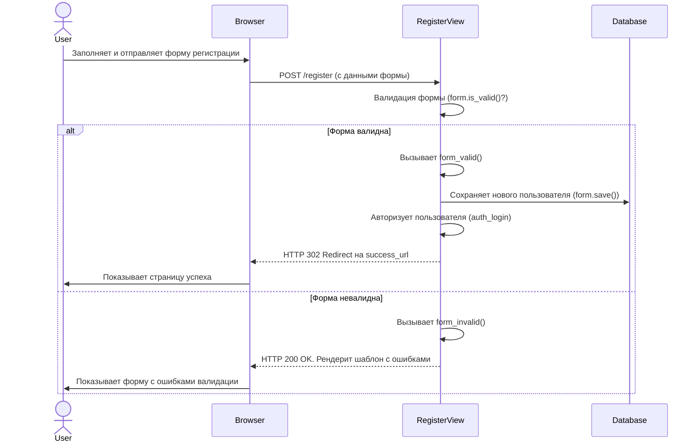
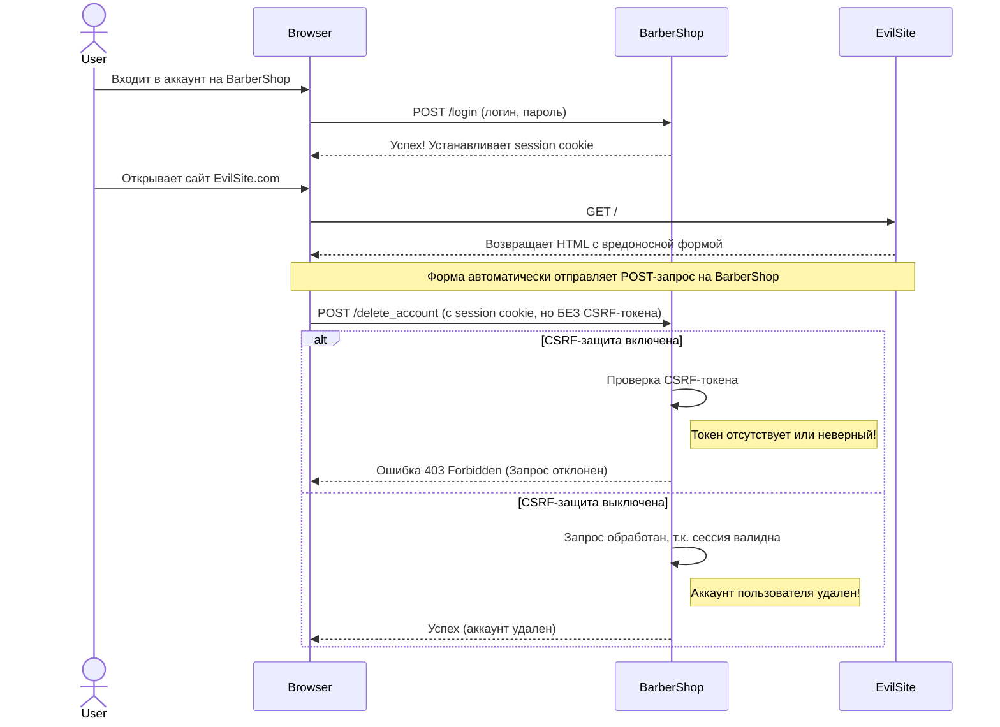

# Lesson 67. Django Auth Ч2. Регистрация, логин, логаут на классовых инструментах

## Class LogoutView 🚪

Продолжая тему аутентификации, давайте рассмотрим, как элегантно реализовать выход пользователя из системы с помощью классовых представлений Django. Мы уже подготовили для этого почву.

### Подготовка шаблона 📝

В предыдущих уроках мы создали в меню элемент для выхода. Это не просто ссылка, а форма, замаскированная под кнопку.

```html
<li class="nav-item">
    <form action="" method="post" class="d-inline">
        
        <button type="submit" class="nav-link btn btn-link">Выход</button>
    </form>
</li>
```

Такой подход с использованием метода `POST` является более безопасным и предпочтительным, особенно при работе с классовыми представлениями. В то время как для простой функциональной view мог бы подойти и `GET`-запрос, стандартный `LogoutView` ожидает именно `POST`. Это защищает от случайного "вылогинивания" пользователя, если поисковый робот перейдет по ссылке. Мы заранее сделали все правильно, и теперь переход на классовую view будет безболезненным.

### Переход на классовую вью 🚀

Теперь заменим нашу функциональную view на классовую. Для этого создадим `CustomLogoutView`, унаследованный от встроенного `django.contrib.auth.views.LogoutView`.

```python
from django.contrib.auth.views import LogoutView
from django.urls import reverse_lazy

class CustomLogoutView(LogoutView):
    next_page = reverse_lazy('home')
```

Как видите, код очень лаконичен. Мы просто указываем, куда перенаправить пользователя после выхода, используя атрибут `next_page`. Использование `reverse_lazy` здесь обязательно, так как URL-ы еще могут быть не загружены в момент инициализации класса.

> [!info]
> #### Кастомизация `LogoutView` ⚙️
> Хотя в большинстве случаев достаточно указать `next_page`, `LogoutView` предоставляет и другие точки для кастомизации:
> - **`template_name`**: Если вы хотите показывать специальную страницу после выхода (например, "Вы успешно вышли. До свидания!"), можно указать путь к шаблону. По умолчанию `LogoutView` не рендерит шаблон.
> - **`get_next_page()`**: Можно переопределить этот метод для динамического определения URL перенаправления.
> - **`dispatch()`**: Для добавления сложной логики, которая должна выполниться до или после выхода пользователя, можно переопределить метод `dispatch()`.

## Авторизация на классовых инструментах Django 🔐

Для входа и регистрации пользователей Django предлагает мощные классовые инструменты: `LoginView` для авторизации и `CreateView` в связке с `UserCreationForm` для регистрации. Давайте разберемся, как их эффективно использовать и кастомизировать.

Хотя технически возможно подключить `LoginView` прямо в `urls.py`, передав нужные параметры, это считается не лучшей практикой, так как смешивает логику и конфигурацию.

```python
# urls.py - НЕ РЕКОМЕНДУЕТСЯ

from django.urls import path
from django.contrib.auth.views import LoginView
from django.contrib.auth.forms import AuthenticationForm

urlpatterns = [
    # Технически возможно, но плохо для поддержки
    path('login/', LoginView.as_view(
        template_name='users/login.html',
        authentication_form=AuthenticationForm
    ), name='login'),
]
```
Гораздо более гибкий и правильный подход — создать собственные классы форм и представлений.

### Кастомная форма `CustomAuthenticationForm` с Bootstrap 5 🎨

Стандартная форма авторизации `AuthenticationForm` не имеет стилей. Чтобы интегрировать ее с Bootstrap, мы можем унаследовать от нее и добавить CSS-классы к полям.

```python
# users/forms.py
from django.contrib.auth.forms import AuthenticationForm

class CustomAuthenticationForm(AuthenticationForm):
    def __init__(self, *args, **kwargs):
        super().__init__(*args, **kwargs)
        for field in self.fields.values():
            field.widget.attrs.update({'class': 'form-control'})
```
Этот простой класс перебирает все поля формы и добавляет им класс `form-control`, что мгновенно преображает их внешний вид в соответствии со стилями Bootstrap.

### Кастомный класс `CustomLoginView` 🛠️

Теперь создадим собственное представление для входа, которое будет использовать нашу кастомную форму.

```python
# users/views.py
from django.contrib.auth.views import LoginView
from .forms import CustomAuthenticationForm
from django.urls import reverse_lazy

class CustomLoginView(LoginView):
    form_class = CustomAuthenticationForm
    template_name = 'users/login.html'
    success_url = reverse_lazy('home')
```
Здесь мы указываем три ключевых атрибута:
- `form_class`: Наша стилизованная форма.
- `template_name`: Шаблон, который будет отображать форму.
- `success_url`: URL для перенаправления после успешного входа.

### Кастомный класс `RegisterView` 📝

В Django нет встроенного `RegisterView`, но для создания новых объектов идеально подходит `CreateView`. В связке со специальной формой `UserCreationForm` мы получаем мощный инструмент для регистрации.

Минимальная реализация выглядит так:
```python
# users/views.py
from django.views.generic import CreateView
from .forms import CustomUserCreationForm # Предполагаем, что эта форма тоже создана и стилизована
from django.urls import reverse_lazy

class RegisterView(CreateView):
    template_name = "users/register.html"
    form_class = CustomUserCreationForm
    success_url = reverse_lazy("home")
```
Однако, как правило, после регистрации мы хотим не просто перенаправить пользователя, а еще и сразу его авторизовать, а также показать приветственное сообщение. Для этого нужно переопределить методы `form_valid` и `form_invalid`.

```python
# users/views.py
from django.shortcuts import redirect
from django.contrib import messages
from django.contrib.auth import login as auth_login

class RegisterView(CreateView):
    template_name = "users/register.html"
    form_class = CustomUserCreationForm
    success_url = reverse_lazy("home")

    def form_valid(self, form):
        user = form.save()
        messages.success(
            self.request,
            f"Добро пожаловать, {user.username}! Вы успешно зарегистрировались."
        )
        auth_login(self.request, user)
        return redirect(self.get_success_url())

    def form_invalid(self, form):
        messages.error(self.request, "Пожалуйста, исправьте ошибки в форме.")
        return super().form_invalid(form)
```

> [!info]
> #### Пояснение методов `form_valid` и `form_invalid`
> - **`form_valid(self, form)`**: Этот метод вызывается, когда пользователь отправил корректные данные. Здесь мы:
>     1. `form.save()`: Сохраняем нового пользователя в базе данных.
>     2. `messages.success()`: Добавляем флеш-сообщение об успехе.
>     3. `auth_login()`: Выполняем вход пользователя в систему сразу после регистрации.
>     4. `redirect()`: Перенаправляем на нужную страницу.
> - **`form_invalid(self, form)`**: Вызывается, если форма не прошла валидацию. Мы добавляем сообщение об ошибке и затем вызываем родительский метод, который снова отрендерит страницу с формой и ошибками валидации.

Вот как выглядит процесс регистрации на диаграмме:


### Приоритеты перенаправления после входа 🚦

Классовые представления Django, такие как `LoginView`, имеют четко определенный порядок, в котором они ищут URL для перенаправления пользователя после успешного входа. Понимание этого приоритета поможет вам гибко управлять поведением вашего приложения.

> [!warning]
> #### Иерархия приоритетов
> Django проверяет эти опции в строгом порядке сверху вниз. Первая найденная опция будет использована.

#### 1. Параметр `next` в URL
Это самый высокий приоритет. Если в URL страницы входа присутствует GET-параметр `next` (например, `/users/login/?next=/profile/`), Django после успешной авторизации перенаправит пользователя именно по этому адресу. Это очень удобно для сценариев, когда неавторизованный пользователь пытается получить доступ к защищенной странице: система перенаправляет его на страницу входа, а после успешного логина возвращает на ту страницу, куда он изначально хотел попасть.

#### 2. Атрибут `success_url` в классе View
Если параметр `next` отсутствует, Django ищет атрибут `success_url` в вашем классе представления. Это самый простой способ задать статическую страницу для перенаправления.

```python
class CustomLoginView(LoginView):
    # ...
    success_url = reverse_lazy('profile')
```

#### 3. Метод `get_success_url()` в классе View
Этот метод дает максимальную гибкость. Если он определен в классе, Django вызовет его для получения URL. Это позволяет реализовать сложную логику: например, перенаправлять администраторов в админ-панель, а обычных пользователей — в их профиль.

```python
class CustomLoginView(LoginView):
    # ...
    def get_success_url(self):
        user = self.request.user
        if user.is_staff:
            return reverse_lazy('admin:index')
        return reverse_lazy('profile')
```

#### 4. Константа `LOGIN_REDIRECT_URL` в `settings.py`
Если ни один из вышеперечисленных способов не указан, Django обратится к файлу `settings.py` и будет искать значение константы `LOGIN_REDIRECT_URL`. Это глобальная настройка, которая служит "запасным" вариантом по умолчанию для всего проекта.

```python
# settings.py

# URL, куда перенаправлять после успешного входа, если не указано иное
LOGIN_REDIRECT_URL = reverse_lazy("home")

# URL страницы входа, используется декоратором @login_required
LOGIN_URL = reverse_lazy("login")

# URL, куда перенаправлять после выхода
LOGOUT_REDIRECT_URL = reverse_lazy("home")
```

## Настройка сессии и безопасность 🛡️

Сессии — это механизм, который позволяет вашему сайту "помнить" пользователя между запросами. Это критически важная часть аутентификации, но она требует внимательной настройки для обеспечения безопасности.

### Конфигурация сессий в `settings.py` ⚙️

В Django есть несколько ключевых настроек для управления поведением сессий.

```python
# settings.py

# Время жизни сессии в секундах. По умолчанию 2 недели.
# Установим на 1 час для примера.
SESSION_COOKIE_AGE = 3600

# Продлевать жизнь сессии при каждом запросе от пользователя.
# Если True, таймер сессии будет сбрасываться при каждой активности.
SESSION_SAVE_EVERY_REQUEST = True

# (Опционально) Выходить из системы при закрытии браузера.
# Если True, сессия становится "сессионной" и не сохраняется на диск.
SESSION_EXPIRE_AT_BROWSER_CLOSE = False
```

> [!warning]
> #### Опасность длинных сессий
> Длинные сессии (недели или месяцы) повышают риск **угона сессии (Session Hijacking)**. Если злоумышленник перехватит `sessionid` пользователя, он сможет использовать его до тех пор, пока сессия не истечет. Короткое время жизни сессии минимизирует этот риск.

### CSRF-защита: Как она работает? 🛡️

CSRF (Cross-Site Request Forgery) — это атака, при которой злоумышленник заставляет браузер аутентифицированного пользователя выполнить нежелательное действие на вашем сайте. Django имеет встроенную защиту от этого.

**Как это работает:**
1.  Когда Django рендерит форму с методом `POST`, тег `` вставляет в нее скрытое поле с уникальным токеном.
2.  При отправке формы Django проверяет, совпадает ли токен из формы с токеном, привязанным к сессии пользователя.
3.  Злоумышленник, создавая поддельную форму на своем сайте, не знает этот токен, поэтому его запрос будет отклонен с ошибкой 403.

Эта диаграмма иллюстрирует, как CSRF-защита предотвращает атаку:



### CSRF-токен против угона сессии: Разные рубежи обороны

Очень важно понимать: **CSRF-токен НЕ защищает от уже угнанной сессии.**

Если злоумышленник украл ваш `sessionid` (например, через незащищенный Wi-Fi), он может сам запросить у вашего сервера страницу с формой, получить валидный CSRF-токен для вашей сессии и выполнить любое действие от вашего имени.

> [!error]
> #### CSRF и угон сессии - это разные угрозы!
> - **Защита от CSRF** гарантирует, что запрос пришел с вашего сайта, а не со стороннего.
> - **Защита от угона сессии** мешает злоумышленнику в принципе завладеть вашим `sessionid`.

**Настоящая защита от угона сессии включает:**
1.  **HTTPS:** Шифрование всего трафика. Это **обязательно**.
2.  **Короткое время жизни сессии:** Минимизирует окно для атаки.
3.  **Атрибуты Cookie `Secure` и `HttpOnly`:** Django использует их по умолчанию при `SESSION_COOKIE_SECURE=True`.

### Часто задаваемые вопросы о Cookies 🍪

#### Почему `sessionid` выдается только после авторизации?
На самом деле, Django создает сессию и для анонимных пользователей, но отправляет cookie `sessionid` браузеру только тогда, когда сессия **впервые изменяется** (например, вы что-то в нее записали: `request.session['key'] = 'value'`). Авторизация (`login`) всегда изменяет сессию, поэтому после нее `sessionid` появляется гарантированно.

#### Можно ли записывать данные в сессию анонима?
Да, конечно. Именно так работают гостевые корзины в интернет-магазинах. Вы можете работать с `request.session` как со словарем для любого пользователя. Как только вы запишете туда данные, анонимный пользователь получит свой `sessionid`.

```python
# Пример: гостевая корзина
def add_to_guest_cart(request):
    cart = request.session.get('guest_cart', [])
    product_id = request.GET.get('product_id')
    if product_id:
        cart.append(product_id)
    # Эта строка инициирует отправку cookie, если его не было
    request.session['guest_cart'] = cart
    # ...
```

#### Почему в браузере может быть два разных CSRF-токена?
Обычно это происходит в гибридных приложениях.
- **`csrftoken`**: Стандартный cookie от Django, используется для обычных HTML-форм. Живет долго (по умолчанию год).
- **`CSRF-Token-XXXX`**: Нестандартный cookie, который, скорее всего, устанавливается JavaScript-кодом (например, для AJAX-запросов в SPA). Часто он является сессионным.

## Смена пароля 🔑

Для смены пароля Django предоставляет готовые инструменты, аналогичные тем, что мы использовали для входа: `PasswordChangeView` и `PasswordChangeForm`.

### Использование `PasswordChangeView`

Процесс кастомизации очень похож на `LoginView`. Мы создаем свой класс, наследуясь от `PasswordChangeView`, и указываем необходимые атрибуты.

```python
# users/views.py
from django.contrib.auth.views import PasswordChangeView
from django.contrib.auth.forms import PasswordChangeForm
from django.urls import reverse_lazy

class CustomPasswordChangeView(PasswordChangeView):
    form_class = PasswordChangeForm # Можно использовать кастомную, стилизованную форму
    template_name = 'users/password_change_form.html'
    success_url = reverse_lazy('password_change_done') # URL страницы "Пароль успешно изменен"
```

> [!info]
> #### Важный момент: `PasswordChangeForm`
> В отличие от `AuthenticationForm`, форма `PasswordChangeForm` требует передачи объекта `user` при инициализации. `PasswordChangeView` делает это за нас автоматически.

### Страница подтверждения

После успешной смены пароля пользователя **необходимо** перенаправить на страницу подтверждения. Для этого в Django есть `PasswordChangeDoneView`.

```python
# users/urls.py
from django.urls import path
from .views import CustomPasswordChangeView
from django.contrib.auth.views import PasswordChangeDoneView

urlpatterns = [
    # ...
    path('password_change/', CustomPasswordChangeView.as_view(), name='password_change'),
    path('password_change/done/',
         PasswordChangeDoneView.as_view(template_name='users/password_change_done.html'),
         name='password_change_done'),
]
```
На странице `password_change_done.html` вы можете разместить сообщение об успешной смене пароля и ссылку на страницу входа или в профиль.

### Процесс выхода из системы

Вот как схематично выглядит процесс выхода пользователя из системы.

```mermaid
sequenceDiagram
    actor User
    participant Browser
    participant Server
    participant Database

    User->>Browser: Нажимает "Выйти"
    Browser->>Server: POST /logout

    Server->>Server: Вызывает logout(request)
    Note right of Server: Внутри logout() вызывается request.session.flush()

    Server->>Database: DELETE FROM django_session WHERE session_key = 'старый_sessionid'
    Note right of Server: 1. Уничтожает сессию на сервере

    Server-->>Browser: HTTP 302 Redirect с заголовком Set-Cookie
    Note right of Server: Заголовок Set-Cookie приказывает браузеру удалить cookie

    Browser->>Browser: Удаляет cookie 'sessionid'
    Browser->>User: Перенаправляет на главную страницу (уже без сессии)
